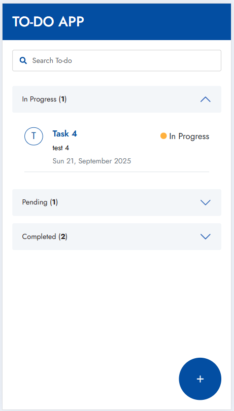
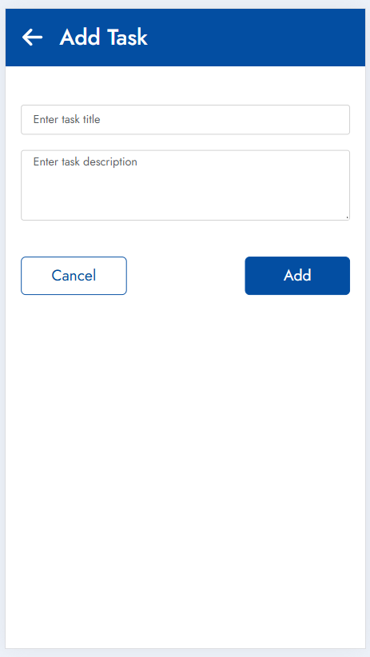
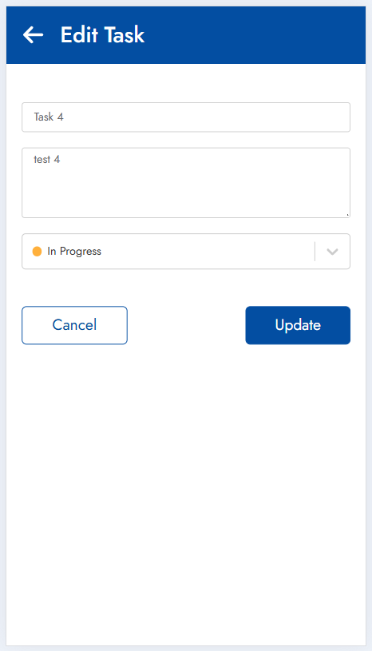
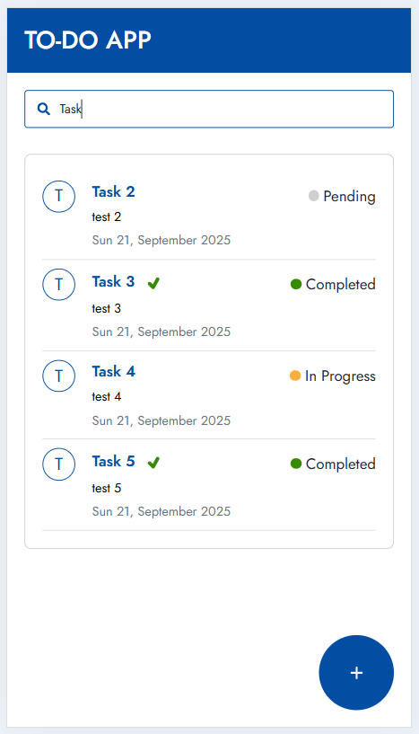

# React To-Do App

A simple and interactive To-Do application built with **React**, featuring task management, search, status filtering, and smooth UX with loaders. Designed for easy deployment and live sharing.

## Features

- Add, edit, and delete tasks.
- Task statuses: Pending, In Progress, Completed.
- Search tasks with instant filtering.
- Accordion view for task status categories.
- Highlight recently updated tasks.
- Loader for better UX during page loads.
- Fully responsive layout.
- Deployed live ([Todo-Tracker](https://todo-tracker-5pr6.vercel.app/)).

## Screenshots






## Technologies Used

- React (Functional Components + Hooks)
- TypeScript
- React Router
- React Icons
- Bootstrap 5
- LocalStorage for task persistence

## Getting Started

### Prerequisites

Make sure you have **Node.js** and **npm** installed:

```bash
node -v
npm -v
```

Installation

Clone the repository:

git clone https://github.com/Shikha0567/Todo-Tracker
cd Todo-Tracker

Install dependencies:

npm install

Start the development server:

npm start

The app will run on http://localhost:3000.
